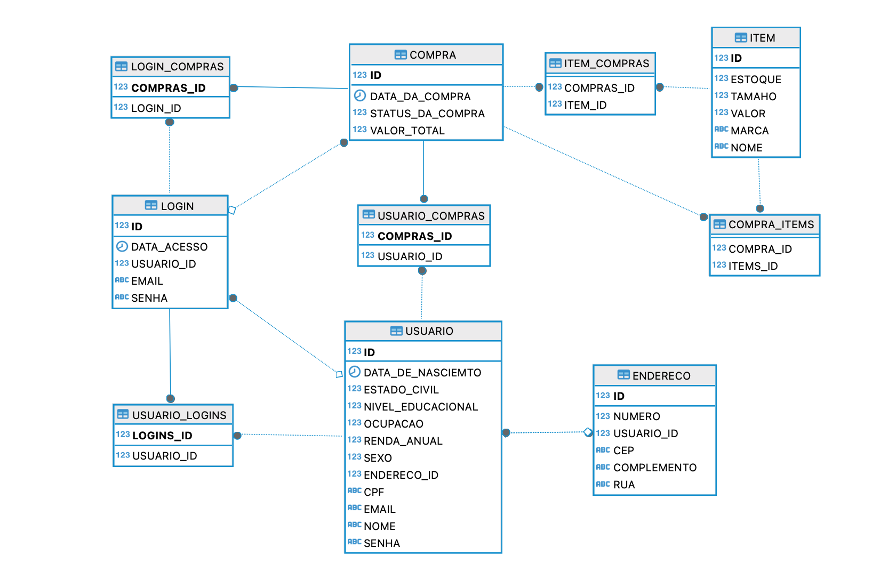

# Markfy

## Integrantes do Grupo:

### Representante/gestor do projeto:
- Bruno de Paula (RM552226)

### Líder Técnico:
- Kayque Lima (RM550782)

### Desenvolvedor Frontend/Mobile:
- Gabriel França (RM551905)

### Desenvolvedor/redator:
- Edward de Lima (RM98676)

## Como Rodar a Aplicação:

Para rodar a aplicação, siga os passos abaixo:

1. Clone o repositório do projeto para o seu ambiente local.
2. Certifique-se de ter o Java JDK e o Spring Boot instalados em sua máquina.
3. Abra o terminal e navegue até o diretório raiz do projeto.
4. Execute o comando `./mvnw spring-boot:run` para iniciar o servidor.
5. Use o `-Dspring.profiles.active=dev` caso queira rodar em um ambiente de dev com um banco de dados em memória .
5. Acesse a aplicação em seu navegador utilizando o endereço `http://localhost:8080/gerenciamento-de-compras`.

## Diagramas:

Diagrama de classes:

Diagrama de Entidade e Relacionamento:

## Vídeo de Apresentação:

[Link para o vídeo de apresentação](#)

## Documentação da API:

Aqui estão listados todos os endpoints disponíveis na API de acordo com os domínios do software:

#### Login
1. POST `/login`: Realiza o login de um usuário já existente no sistema.
2. GET  `/login`: Lista todos os logins já feitos.
3. GET  `/login/{id}`: Retorna um login específico com base no ID fornecido.

### Usuário
4. POST `/usuario`: Cadastra um usuário no sistema.
5. GET  `/usuario`: Lista todos os usuários presentes na base de dados.
6. GET  `/usuario/{id}`: Retorna um usuário específico com base no ID fornecido.
7. PUT `/usuario/{id}`: Altera as informações de um usuário na base de dados
8. DELETE `/usuario/{id}`: Deleta um usuário da base de dado

### Endereço
9. GET `/endereco`: Lista todos os endereços presentes na base de dados.
10. GET  `/endereco/{id}`: Retorna um endereço específico com base no ID fornecido.
11. PUT `/endereco/{id}`: Altera as informações de um endereço na base de dados

### Item
12. POST `/item`: Cadastra um item no sistema.
13. GET  `/item`: Lista todos os items presentes na base de dados.
14. GET  `/item/{id}`: Retorna um item específico com base no ID fornecido.
15. PUT `/item/{id}`: Altera as informações de um item na base de dados
16. DELETE `/item/{id}`: Deleta um item da base de dado

### Compra
17. POST `/compra`: Cadastra uma compra no sistema.
18. POST `/compra/{id}`: Confirma que a compra foi realizada com êxito.
19. GET  `/compra`: Lista todos os compras presentes na base de dados.
20. GET  `/compra/{id}`: Retorna uma compra específico com base no ID fornecido.
21. DELETE `/compra/{id}`: Deleta uma compra da base de dados

## Atenção
Para mais detalhes sobre cada endpoint, na raiz do repositório disponibilizamos a collection do Insomnia com todas as requisiçoes existentes. Siga os passos abaixo para executá-las.
1. Faça o download do software Insomnia
2. Faça o download do arquivo: `Insominia_Collection_Markfy.json`
3. No Insomnia importe esse JSON como uma nova collection.
